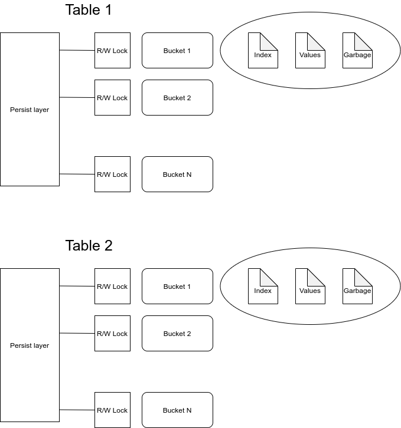

# URL shorten service

## About
Implementation of custom property-based storage. 

### How it works
Structure of database:



#### __Insert__
The index file contains sorted pairs - key and value position. If the key length is less than configured then it is fulfilled with whitespaces. If the length of the key is more than an exception is thrown. 

There are two implementations - single and multi-value storage. In the case with a single value when trying to insert the same key an exception is thrown. 

#### __Get__

Using key proper bucket is chosen. After this in index file by binary search value (values in case of multivalue storage) position is found. Value is located in value file starting from position to new line symbol.

#### __Update__
Update operation is not implemented. If you want to make an update it is needed to delete the value and then make update.

#### __Delete__

The delete operation is performed in 3 stages:
1. Deleted keys are saved in memory. Before each operation keys are checked on presence in such list. In this stage, no work with files is performed till:
    1. list size exceeds a preset value
    2. after setted period of time (using a cron job)

2. At this stage values from in-memory list are removed from index file to garbage file. Index file after this is shrunk.

3. The most durable stage - using garbage file value file is cleaned and shrunk and index file is updated with new positions _(Not implemented)_

## Tech stack
* Java 11
* Maven 3.6.3
* Micronaut framework for http server side
* Swagger

## How to run

1. Build application
    ```shell
    mvn clean install
    ```
1. Run application
    ```shell
   mvn mn:run
    ```
## Documentation

* [Swagger link](http://localhost:8080/swagger/shorten-url-service.yml)
* [Swagger UI](http://localhost:8080/swagger-ui/index.html)